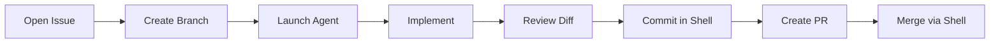
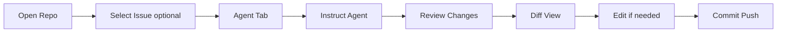

# Workflows

Primary user workflows for Kiwi. Each workflow assumes repository already opened via `kiwi /path/to/repo`.

## Issue-Driven Development

End-to-end flow staying inside Kiwi:

### Step-by-step

1. **Open GitHub Issue** — Main tab `Issues`; select issue or search in GH left tab.
2. **Create branch** — Command palette: `Issue: Create Branch` → runs `gh issue develop`.
3. **Launch AI Agent** — Main tab `Agent`; give instructions referencing issue number.
4. **Implement changes** — Agent edits files; user may `e` open files in external editor.
5. **Review diff** — Left `Git` or `Diff`; main `Diff` tab for hunks.
6. **Commit changes** — Focus shell; `git add` / `git commit`.
7. **Create Pull Request** — Palette: `PR: Create` → `gh pr create` prompts.
8. **Merge** — Shell: `gh pr merge` (UI merge deferred).

### Kiwi surfaces used

| Step | Left Tab | Main Tab | Other |
|------|----------|----------|-------|
| Issue | GH / — | Issues | Status bar issue # |
| Branch | Git | — | Shell |
| Agent | Files | Agent | — |
| Review | Git, Diff | Diff | Preview |
| PR | GH | PRs | Shell |

---

## AI-Driven Development

For exploratory work with less issue ceremony:

### Step-by-step

1. **Open repository** — `kiwi .`
2. **Select issue (optional)** — Link context for agent prompt.
3. **Open Agent tab** — Wait for PTY spawn.
4. **Give instructions** — Type in agent session.
5. **Review generated changes** — Git left tab for file list.
6. **View diff** — Main Diff tab.
7. **Edit files if necessary** — `e` opens external editor; watcher refreshes git status.
8. **Commit and push** — Shell pane.

### Tips

- Keep Files tree visible while agent runs for quick navigation.
- Use Preview for read-only inspection without leaving Kiwi.
- Logs tab shows editor launches and `gh` errors.

---

## Traditional Development

Without agent or GitHub focus:

1. **Browse files** — Left `Files`; expand directories lazily.
2. **Open editor** — `e` on selected file.
3. **Run commands** — Shell pane for build/test.
4. **View Git status** — Left `Git`; status bar shows modified count.
5. **Create PR** — When ready, main `PRs` or shell `gh pr create`.

---

## Cross-Cutting Patterns

### External editor

Kiwi never edits in-place. Resolution: config → `$VISUAL` → `$EDITOR` → `nano`.

Terminal editors (vim) may occupy the terminal; recommended: GUI editor or run Kiwi in a multiplexer split.

### Git refresh

No polling. File saves trigger debounced watcher → git status update. Selection preserved.

### GitHub auth

First GitHub action checks `gh auth status`. Failure shows inline setup instructions.

### Command palette

`Ctrl+P` at any step for discoverable actions (refresh, create PR, open editor, focus shell).

## Success Criteria Mapping

From plan.md — developer can without leaving Kiwi:

1. Open repository ✓
2. Browse files ✓
3. View issues ✓
4. Launch AI agent ✓
5. Edit files (via external editor) ✓
6. Review diffs ✓
7. Create pull request ✓

## Related

- [navigation.md](./navigation.md)
- [roadmap/milestones.md](../roadmap/milestones.md)
